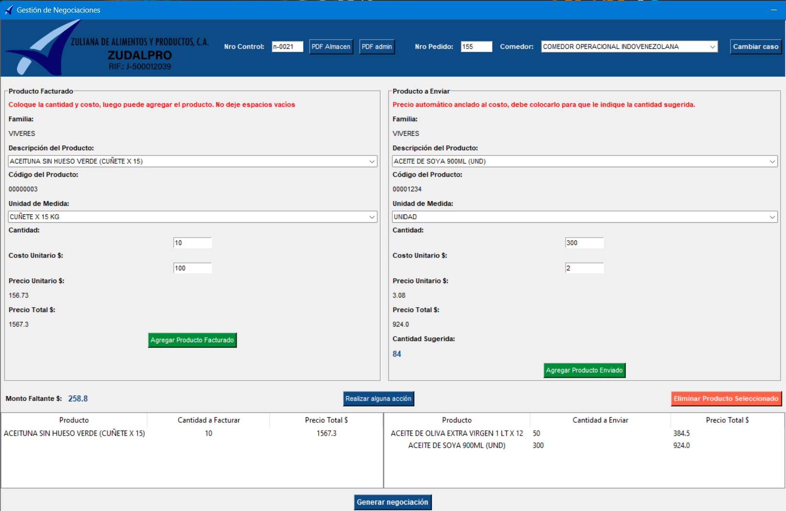

# 🛠️ Gestión de Negociaciones

**Gestión de Negociaciones** es una aplicación de escritorio desarrollada en Python con Tkinter, diseñada para facilitar la administración de negociaciones comerciales mediante una interfaz intuitiva y funcional. La aplicación permite gestionar datos de productos desde una base de datos MySQL, enviar esta información procesada a un servidor SQL Server, realizar cálculos automáticos y generar reportes en PDF. Además, cuenta con integración a un dashboard de métricas en Looker Studio y una opción de instalación simplificada.

---

## 📌 Características Principales

- **Integración de Bases de Datos**: Conecta a una base de datos MySQL para obtener información actualizada y envía datos procesados a SQL Server.
  
- **Interfaz Amigable**: Utiliza listas desplegables alimentadas directamente desde MySQL para simplificar la entrada de datos.

- **Cálculos Automáticos**: Realiza cálculos de montos faltantes y sugiere cantidades, optimizando la toma de decisiones.

- **Dashboard de Métricas**: Accede directamente desde la app a un dashboard en Looker Studio con métricas detalladas de todas las negociaciones realizadas.

- **Generación de Reportes en PDF**: Al finalizar, genera un PDF con un resumen de los productos, incluyendo cálculos y un número de control único.

- **Actualización e Instalación Sencilla**: Descarga nuevas versiones de la app desde una página principal ejecutable. La instalación elimina automáticamente la versión anterior para facilitar actualizaciones.

## 🧩 Funcionalidades Detalladas

### 1. **Ingreso y Selección de Productos**
   - Selección de productos y cantidades a través de listas desplegables.
   - Cálculo automático de precios totales basado en el precio unitario y la cantidad.
   - Opciones para agregar o eliminar productos fácilmente.

### 2. **Gestión de Cantidades y Cálculos Automáticos**
   - **Cálculo de Montos Faltantes**: Determina automáticamente el monto necesario para completar una negociación.
   - **Sugerencia de Cantidades**: Sugiere la cantidad óptima de productos en función del monto faltante.
   - **Actualización Dinámica**: Los cálculos se actualizan en tiempo real conforme se ingresan datos nuevos.

### 3. **Dashboard en Looker Studio**
   - Accede a un dashboard con métricas y reportes visuales sobre todas las negociaciones.
   - Incluye información consolidada que permite monitorear el rendimiento y estadísticas de la aplicación.

### 4. **Exportación de Reportes en PDF**
   - Genera un PDF con:
     - Resumen de productos y cálculos de montos.
     - Un número de control único para seguimiento.
   - El PDF se almacena en una carpeta especificada, permitiendo fácil consulta y archivo.

### 5. **Actualización e Instalación Simplificada**
   - Descarga nuevas versiones desde una página de inicio ejecutable.
   - El instalador (`Setup.exe`) reemplaza automáticamente la versión anterior.

## ⚙️ Tecnologías Utilizadas

- **Lenguajes y Frameworks**:
  - **Python**: Desarrollo principal de la aplicación.
  - **Tkinter**: Interfaz gráfica de usuario.

- **Bases de Datos**:
  - **MySQL**: Para alimentar la gestión de productos desde el ERP.
  - **SQL Server**: Para almacenar datos de negociaciones.

- **Análisis y Visualización**:
  - **Looker Studio**: Dashboard con métricas y visualizaciones de datos.

- **Librerías**:
  - **pandas**: Manipulación de datos.
  - **numpy**: Operaciones numéricas avanzadas.
  - **reportlab**: Generación de archivos PDF.
  - **webbrowser**: Acceso directo a páginas web desde la app.
  
## 🚀 Instalación y Ejecución

### Prerrequisitos
- **Python 3.x** instalado.
- **MySQL** y **SQL Server** configurados.
- Dependencias Python: instala usando `pip install -r requirements.txt`.

### Pasos de Instalación

1. Clona el repositorio:
   git clone https://github.com/usuario/gestion-negociaciones.git
   cd gestion-negociaciones
2. Volver el archivo app ejecutable con sus dependencias no necesita tener python la pc
3. Volver el ejecutable un instalador para que haga la instalacion con un Setup.exe
NOTA: Debes usar tus credenciales de tus bases de datos la app solo tiene una instruccion de uso
4. Ejecutar el instalador y se mostrara una la pantalla principal de la app de esta manera

